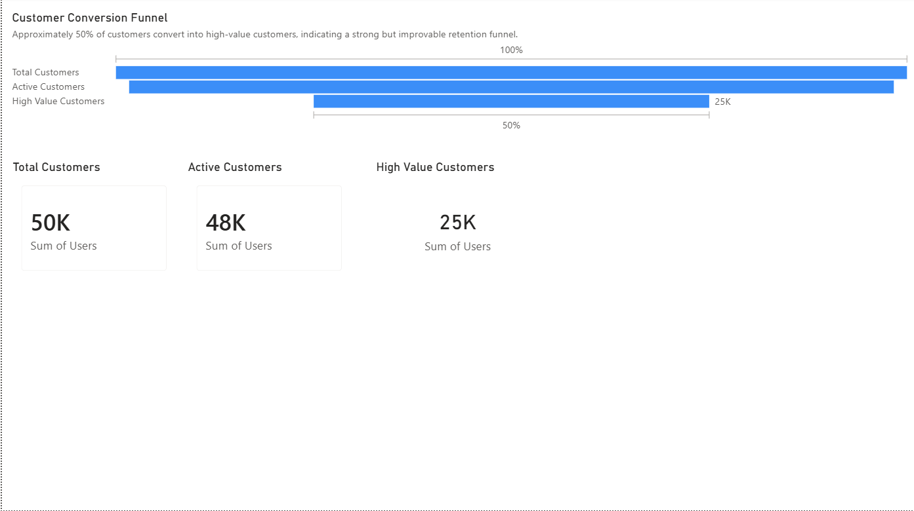
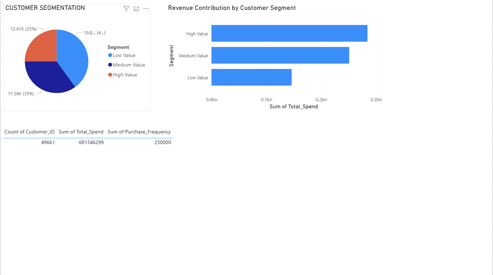
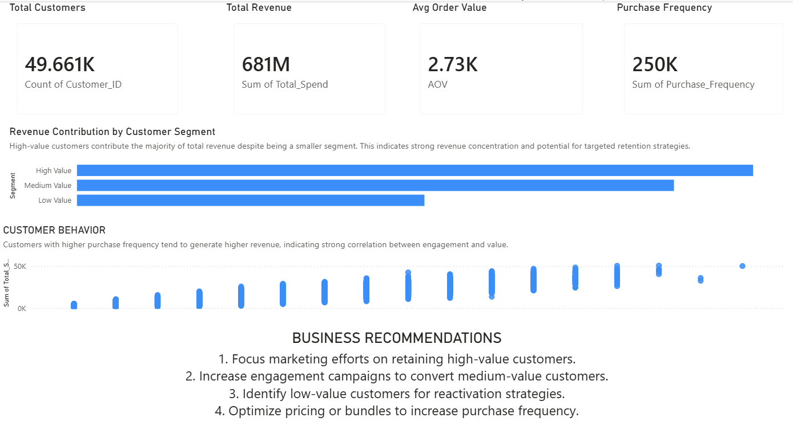

# E-commerce Customer & Funnel Analysis

Analysis of ~50K customers and $681M in revenue to understand purchasing behavior, segment customers by value, and identify where the business should focus retention and growth efforts.

## Project Overview

- Understand customer purchasing behavior
- Segment customers based on value (high / medium / low)
- Analyze revenue contribution by segment
- Identify opportunities to improve conversion and retention

## Dashboard Preview

**Overview**

**Customer Segmentation**

**Business Insights**

## Key Metrics

- **Total Customers:** 49,661
- **Total Revenue:** $681M
- **Average Order Value (AOV):** $2.73K

## Key Insights & Recommendations

- **High-value customers drive the majority of revenue** — retention strategies should be prioritized here to protect this base.
- **Medium-value customers show strong growth potential** — targeted engagement campaigns could shift them into the high-value tier.
- **Low-value customers need reactivation** — targeted offers or win-back campaigns are the right lever here, not broad discounting.
- **Purchase frequency strongly correlates with revenue** — pricing and bundling strategies that increase order frequency would compound revenue gains.

## Dataset

- Customer transaction data
- Purchase frequency data
- Funnel stage data

## Tools & Technologies

- Python (Pandas, NumPy)
- Power BI (Dashboard & Visualization)
- Jupyter Notebook
- Git / GitHub

## Repository Structure

- `data/` — customer, transaction, and funnel-stage datasets
- `dashboard/` — Power BI dashboard file (.pbix)
- `notebooks/` — Python analysis notebook
- `visuals/` — dashboard preview screenshots

## Conclusion

This project demonstrates how data analysis and visualization can be used to drive business decisions, improve customer targeting, and increase revenue.

## Author

Ahmed Khalid
